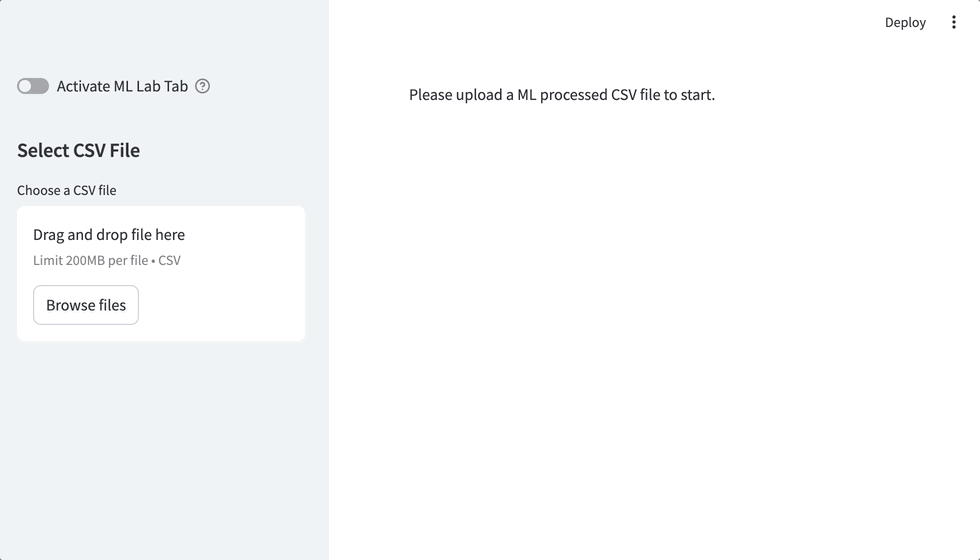
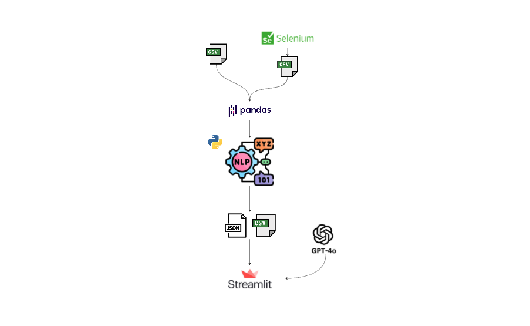
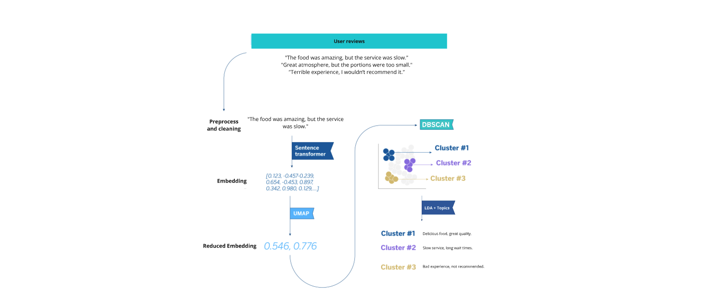

# Sentiment Analysis and Review Classification Project



<br></br>
<p align="center">
    <a href="https://sentiment-analysis-reviews.streamlit.app/" target="_blank">
        
    </a>
</p>
<br></br>

## Overview
This project aims to provide a simple, cost-effective solution for small online stores and startups to analyze customer reviews. The main goal is to extract insights from customer feedback that will help these businesses improve their products and services. By using Python tools and machine learning, this project helps to classify customer sentiment (positive, neutral, negative) and presents these insights in an easy-to-read dashboard using Streamlit.

## Problem Statement
Small commerce businesses often lack the resources to conduct in-depth analysis of customer reviews. Understanding customer satisfaction through reviews can be crucial for product and service improvements. This project addresses this need by delivering a solution that is both accessible and scalable, allowing small businesses to efficiently analyze customer sentiment without the need for extensive technical knowledge or expensive tools.

## Technologies
- **Selenium**: Used for scraping customer reviews from online stores.
- **CSV/Google Drive**: Data storage in CSV format, either locally or in Google Drive.
- **pandas**: Used for cleaning and processing the text data.
- **scikit-learn**: Implements a simple machine learning model for sentiment analysis.
- **streamlit**: Displays the results in an accessible and interactive dashboard.



## Project Phases
1. **Data Collection (raw and with Scraping)**: Reviews will be collected from online stores using Python's Scrapy framework and stored in CSV format.
2. **Data Cleaning**: The raw data will be saved in CSV files locally or in Google Drive.
3. **Data Analysis**: The data will be processed using pandas to clean and prepare it for machine learning analysis.  A machine learning model, implemented in scikit-learn, will classify reviews as positive, neutral, or negative.
4. **Data Visualization**: The results of the analysis will be displayed with a streamlit app for easy interpretation and insights.

## Folder Structure

```bash
sentiment-analysis-reviews/
│
├── data/                  
│   ├── raw/                # Raw data collected from Scrapy (CSV)
│   └── processed/          # Cleaned and processed data
│
├── notebooks/
│   ├── scraping.ipynb              # Notebook for scrap the data
│   ├── data_cleaning.ipynb         # Notebook for initial data exploration and cleaning
│   ├── app_dev.ipynb               # Used to test and dev the parts of the streamlit app
│   ├── generate_big_sample.ipynb   # Generate a example dataset using yelp dataset as base: https://www.yelp.com/dataset/documentation/main
│   └── sentiment_analysis.ipynb    # Notebook for training and testing the ML model
│
├── src/                   
│   ├── scraper.py          # Script for scrap the data with selenium
│   ├── cleaning.py         # Script for cleaning the data with pandas
│   ├── ml_processing.py    # Script with functions to do the sentiment analysis and word processing 
│   ├── llm_insights.py     # Script with functions to extract the insights using GPT
│   ├── plots.py            # Script with plot functions for sentiment analysis
│   └── sentiment.py        # Script for sentiment analysis and extraction of insights 
│
├── app/               
│   ├── app.py              # Main code of the streamlit app
│   ├── header.py           # Functions for header
│   ├── tab_1.py            # Functions for tab 1
│   └── tab_3.py            # Functions for tab 3
│
├── img/                    # Images and GIFs for README
├── requirements.txt        # Dependencies (pandas, scikit-learn, scrapy, etc.)
├── environment.yml         # Conda environment configuration
├── chromedriver            # chromedriver exec, download it from Chrome for Developers
├── openai_setup.yml        # Keys for co (dont sync it in your repo!)
├── README.md               # Project documentation
└── .gitignore              # Ignored files for the repository

```

## Phases of the project
### Data Collection

After setting up the project and understanding the folder structure, here’s a guide on collecting review data, either by using any data source you prefer (as long as you adapt it to the required format) or by extracting it directly from Google Maps using the scraper.py script.

#### Data Source Options
You can use any source of review data that suits your needs. Ensure that the data is formatted consistently with the structure expected in the project for smooth integration and analysis. If you need raw review data directly from Google Maps, follow the steps below:

#### 1. **Run `scraper.py` to Extract Raw Data**
To start scraping data from a Google Maps page, you need to run the `scraper.py` script. The script takes two required arguments:
- **URL**: The Google Maps URL of the place you want to scrape.
- **CSV Name**: The name you want to give to the output CSV file.

```bash
python src/scraping/scraper.py "<Google_Maps_URL>" "<output_file_name>"
```

**Example**:
If you want to scrape reviews from a location such as "HD", run the following command:

```bash
python src/scraping/scraper.py "https://www.google.com/maps/place/Casa+Unai/@41.6414965,-0.8941244,15z/data=!4m8!3m7!1s0xd5914da17876fd3:0x567ce7a304ac2a65!8m2!3d41.643107!4d-0.8948281!9m1!1b1!16s%2Fg%2F11bx55_vgb?entry=ttu&g_ep=EgoyMDI0MDkxOC4xIKXMDSoASAFQAw%3D%3D" "hd"
```

This command will:
- Scrape reviews from the provided Google Maps URL.
- Store the raw review data in `collected_hd.csv` located in the `data/raw/` directory.
- Additionally, it will store the star rating summary in `resume_hd.csv` in the same folder.

#### 2. **View Output CSV Files**
Once the script finishes execution, two CSV files will be created in the `data/raw/` folder:
- `collected_reviews_<your_filename>.csv`: This file contains all the detailed reviews.
- `resume_<your_filename>.csv`: This file contains a summary of star ratings and the number of reviews for each rating level.

These CSV files can now be used for further analysis, processing, or visualization.

#### 3. **Adjust Chromedriver Path**
Ensure that the `chromedriver` executable is correctly referenced in the `scraper.py` script. If `chromedriver` is located elsewhere on your system, modify the following line in the `scraper.py` file to reflect the correct path:

```python
chromedriver_path = '../../chromedriver'  # Adjust this path based on your system
```

#### 4. **Customizing the Scraper**
The `scraper.py` file is modular and can be customized to fit different scraping needs. You can extend its functionality or adjust specific parameters like scroll behavior, pause times, or extraction details by modifying the appropriate sections of the code.

This completes the basic steps to scrape raw review data from Google Maps using the `scraper.py` script.

### Data Cleaning
Select the raw file using data_cleaning notebook and generate the processed file. Check the search_keyworkds variable to add the common expressions required to extract the desire info.



### Data Analysis
Once we have the cleaned data, we will extract the necessary information using ML, which we will use as input for the Streamlit.

```bash
python src/scraping/sentiment.py --name "<place_name>" --plot "<boolean_to_see_or_not_the_plots>"
```

The script will extract to the processed folder the insights extracted in json format, samples of some reviews in the periods of interest analysed, and the reviews with the necessary information already processed.

#### Techniques Used
- **Embeddings**: The notebook converts review texts into vector embeddings to capture semantic relationships between reviews, allowing for more nuanced analysis.
- **UMAP & PCA**: These dimensionality reduction techniques are applied to the embeddings to simplify their structure and facilitate visualization. UMAP focuses on preserving local relationships, while PCA captures the main variance in the data. After reducing dimensions, the notebook attempts clustering to group reviews with similar patterns, although results were inconclusive.
- **Low-Score Period Analysis**: The notebook specifically extracts reviews from periods with lower overall scores to analyze negative trends, helping to identify areas for improvement in customer experience.
- **Topic Extraction with LDA**: Latent Dirichlet Allocation (LDA) is used to uncover the main topics in the reviews, providing a clearer picture of what customers frequently discuss, both positively and negatively.
- **Community Analysis with TF-IDF**: Using TfidfVectorizer, the notebook groups reviews into communities based on similar keywords and phrases, enhancing the understanding of common customer concerns.
- **LLMs for Insight Generation**: Large Language Models (LLMs) are utilized to generate in-depth insights based on customer reviews, providing an advanced layer of interpretation for patterns and sentiments within the data.

#### Using the GPT API

The **GPT API** is integrated into this project to enable advanced text analysis and feedback extraction, enhancing the quality of insights derived from customer reviews. This API allows the application to generate nuanced feedback by identifying patterns and sentiments not easily captured by traditional methods.

#### Purpose of the GPT API
The API is used in the **Customer Insights** and **ML Lab** tabs to:
- **Analyze specific customer feedback trends** based on the time period selected by the user.
- **Provide detailed insights** into recurring customer themes, both positive and negative, that might otherwise be missed in the standard analysis.

#### Setup Instructions
1. **API Key**: To enable the GPT functionality, you'll need an API key from OpenAI. If you haven’t done so already, sign up for an API key at [OpenAI's website](https://platform.openai.com/signup).
   
2. **Configuration File**: In the project’s root directory, create or locate the `openai_setup.py` file. Replace the placeholders with your OpenAI credentials as shown below:

```python
   conf = {
       'organization': 'your_organization_key_here',
       'project': 'your_project_key_here',
       'key': 'your_openai_api_key_here'
   }
```

**Important**: Ensure that openai_setup.py is included in your .gitignore file to keep your API key secure and prevent accidental exposure in public repositories.

3. **Activating GPT Analysis:** Once configured, the GPT-based analysis will automatically activate in relevant tabs of the Streamlit app. No further setup is needed on the user's end; simply explore the insights in each tab.

**Usage Notes**
- **Data Privacy:** Be mindful that enabling the GPT API may send review text to OpenAI’s servers. Consider reviewing OpenAI’s data usage policy to understand how your data is handled.
- **API Costs:** Since the GPT API is a paid service, usage may incur costs. Track your usage on the OpenAI dashboard to manage API expenses.


### Data Visualization

To display the extracted insights, I have developed an **interactive Streamlit application** that generates an insightful dashboard. This app allows you to load the processed data and visualize it through user-friendly metrics and graphs. Below is the setup for running the Streamlit application.

1. **App Structure**: The Streamlit app contains a header with key metrics and four main tabs:
   - **📋 Status**: General summary with trends and recommendations.
   - **📢 Customer Insights**: Detailed analysis of strengths, weaknesses, and areas for improvement.
   - **🕵🏻‍♂️ Bad Times Deep Dive**: Analysis of periods with low scores.
   - **🧪 ML Lab**: Space for exploring and experimenting with machine learning techniques on the data.

> **‼️👀🚨 IMPORTANT 🚨👀‼️**: The **ML Lab** tab in the dashboard significantly increases the processing time, especially with large datasets. By default, this tab will be deactivated in the app via a slider. Activate it only if you wish to explore this feature and experiment with machine learning techniques on the data.

2. **Running the App**: To start the application, run the following command in your terminal, navigating to your project’s root directory.

```bash
streamlit run app/app.py
```

3. **Data Loading**: The app allows you to upload the generated **ML file** (processed using `sentiment.py`) to visualize insights. Only this primary file needs to be uploaded; all other necessary files will load automatically. The ML file contains processed reviews data, which is crucial for exploring key metrics, sentiment insights, trends, and advanced machine learning analysis across different tabs.

4. **Interactivity**: The tool offers various filters to customize the data view based on desired information. Additionally, users can dynamically extract insights from selected periods by connecting to the **GPT API** for advanced feedback analysis. In the **ML Lab** tab, several machine learning parameters can be adjusted, allowing users to experiment with the analysis settings and "play" with the results to gain deeper insights or identify patterns.

<br></br>
<p align="center">
    <a href="https://sentiment-analysis-reviews.streamlit.app/" target="_blank">
        
    </a>
</p>
<br></br>


